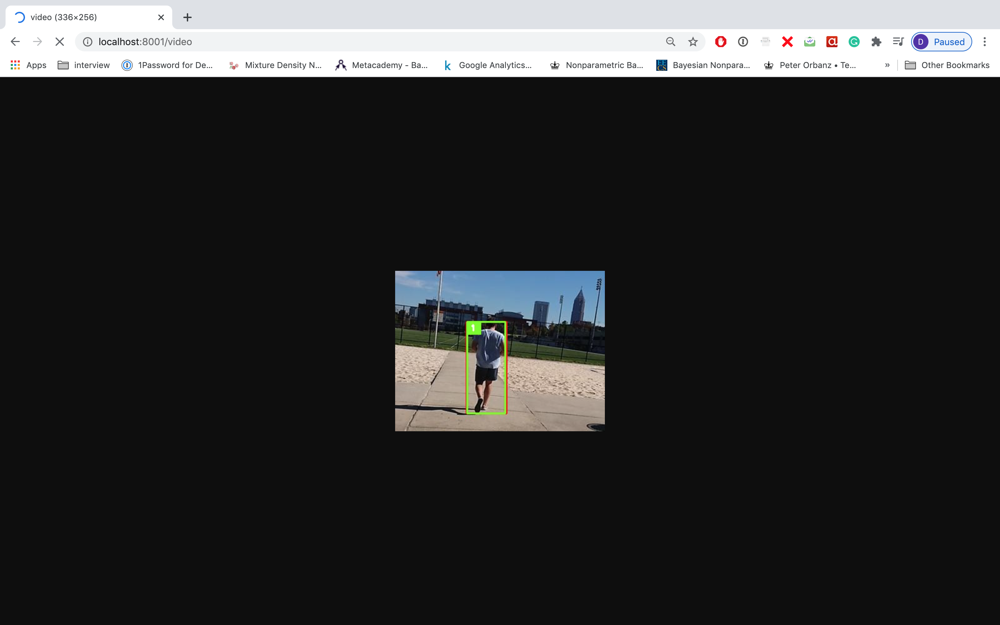

To build this microservice pipleline for online object tracking in videos git clone this repo, cd into the repo, then run:

```
docker-compose up -d --build
```


Once all microservices have booted, the service is ran with the following command:

```
python run.py <path_to_mp4_file.mp4>
```

In a terminal running ```python local_app.py``` will launch a local flask app on port 8001. Navigating to route
/video will render the frame by frame output of the tracking service in the browser.


